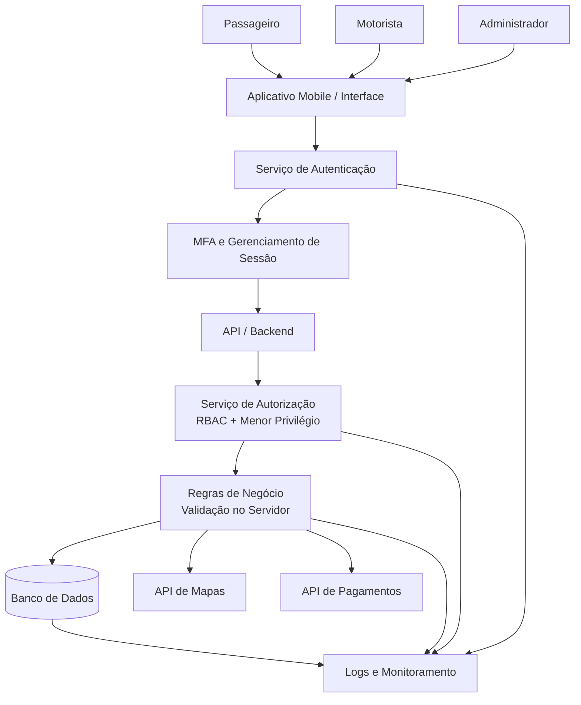

## 18.3 Diagrama da arquitetura segura

O diagrama abaixo representa os principais componentes e controles de segurança propostos para o Move Fácil.

### Principais controles representados

- **Autenticação:** confirma a identidade dos usuários.
- **MFA:** adiciona uma camada adicional de proteção, especialmente para contas administrativas.
- **RBAC:** determina quais funcionalidades cada perfil pode utilizar.
- **Menor privilégio:** concede somente as permissões necessárias para cada função.
- **Validação no servidor:** impede que controles importantes dependam exclusivamente da interface do aplicativo.
- **Banco de dados:** armazena os dados necessários ao funcionamento do sistema.
- **Logs e monitoramento:** registram eventos relevantes de autenticação, autorização e operações críticas.
- **API de mapas:** fornece serviços relacionados à localização.
- **API de pagamentos:** processa as operações relacionadas aos pagamentos.

A arquitetura mantém os principais controles de segurança no backend. Isso evita que uma alteração no aplicativo cliente seja suficiente para contornar as regras de autorização ou de negócio.
