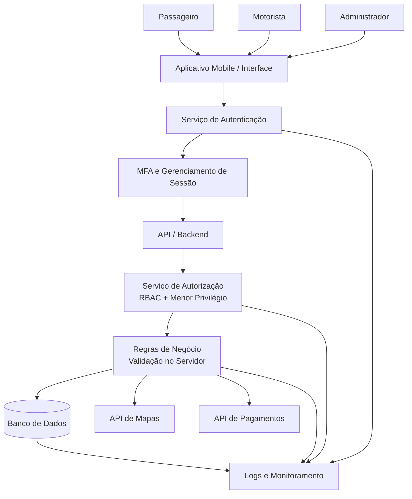

## 18. Requisitos de segurança

### RS01 — Validação da identidade do motorista

| ID | Risco de origem | Requisito de segurança | Critério de verificação |
|---|---|---|---|
| RS01 | R01 — Motorista falso | O sistema deverá validar os documentos de identificação do motorista antes de liberar o acesso às funcionalidades de motorista e permitir o recebimento de corridas. | Uma conta de motorista deverá permanecer bloqueada para receber corridas quando a validação dos documentos não estiver concluída ou for rejeitada. |

O requisito está relacionado ao controle de **validação de identidade e documentos** definido para os riscos do sistema. A Etapa 2 também estabelece que a estratégia de tratamento predominante é reduzir os riscos por meio de controles técnicos, administrativos e operacionais. fileciteturn1file4L247-L269

### RS02 — Proteção da localização

| ID | Risco de origem | Requisito de segurança | Critério de verificação |
|---|---|---|---|
| RS02 | R08 — Vazamento de localização | O sistema deverá permitir o acesso à localização em tempo real somente a usuários e serviços autorizados e quando a informação for necessária para o funcionamento da corrida. | Uma tentativa de consulta à localização por usuário sem autorização deverá ser recusada e registrada nos logs. |

A Etapa 2 define como condição para o risco residual esperado de R08 a existência de **restrição de acesso e monitoramento das consultas de localização**. fileciteturn1file2L165-L170

### RS03 — Autorização administrativa no servidor

| ID | Risco de origem | Requisito de segurança | Critério de verificação |
|---|---|---|---|
| RS03 | R12 — Privilégios administrativos | O sistema deverá validar no servidor, em todas as operações administrativas, se o usuário autenticado possui a função e a permissão necessárias para executar a operação. | Uma requisição administrativa realizada por um usuário sem a permissão correspondente deverá ser recusada pelo servidor, mesmo que a interface permita o envio da requisição. |

O requisito utiliza os controles já definidos na Etapa 2: **controle de acesso baseado em funções, princípio do menor privilégio, MFA e validação das operações no servidor**. fileciteturn1file1L104-L118

## 18.2 Vulnerabilidades catalogadas

Para o mapeamento foram utilizadas referências do catálogo **Common Weakness Enumeration (CWE)**.

| Risco | Vulnerabilidade ou categoria | Referência utilizada | Relação com o sistema |
|---|---|---|---|
| R01 | **CWE-1390 — Weak Authentication** | MITRE CWE | Uma autenticação ou verificação de identidade insuficiente pode não comprovar adequadamente a identidade alegada. No Move Fácil, uma validação insuficiente da identidade do motorista pode contribuir para o cadastro de motoristas falsos. |
| R08 | **CWE-359 — Exposure of Private Personal Information to an Unauthorized Actor** | MITRE CWE | A localização geográfica é considerada informação pessoal privada. A falta de controles adequados pode permitir que essa informação seja acessada por atores não autorizados. |
| R12 | **CWE-862 — Missing Authorization** | MITRE CWE | A ausência de uma verificação de autorização pode permitir que um usuário execute operações ou acesse recursos para os quais não possui permissão, como funções administrativas. |

> **Observação:** foi utilizado o CWE-359 para R08 em vez do CWE-200 porque o CWE-359 é uma categoria mais específica para exposição de informações pessoais privadas e inclui explicitamente localização geográfica. O CWE-200 é uma categoria mais ampla e, atualmente, seu uso para mapeamento de vulnerabilidades reais é desaconselhado pelo próprio MITRE.

Referências:

- MITRE CWE-1390 — Weak Authentication: https://cwe.mitre.org/data/definitions/1390.html
- MITRE CWE-359 — Exposure of Private Personal Information to an Unauthorized Actor: https://cwe.mitre.org/data/definitions/359.html
- MITRE CWE-862 — Missing Authorization: https://cwe.mitre.org/data/definitions/862.html

## 18.3 Diagrama da arquitetura segura

O diagrama abaixo representa os principais componentes e controles de segurança propostos para o Move Fácil.

### Principais controles representados

- **Autenticação:** confirma a identidade dos usuários.
- **MFA:** adiciona uma camada adicional de proteção, especialmente para contas administrativas.
- **RBAC:** determina quais funcionalidades cada perfil pode utilizar.
- **Menor privilégio:** concede somente as permissões necessárias para cada função.
- **Validação no servidor:** impede que controles importantes dependam exclusivamente da interface do aplicativo.
- **Banco de dados:** armazena os dados necessários ao funcionamento do sistema.
- **Logs e monitoramento:** registram eventos relevantes de autenticação, autorização e operações críticas.
- **API de mapas:** fornece serviços relacionados à localização.
- **API de pagamentos:** processa as operações relacionadas aos pagamentos.

A arquitetura mantém os principais controles de segurança no backend. Isso evita que uma alteração no aplicativo cliente seja suficiente para contornar as regras de autorização ou de negócio.

## 18.4 Decisões de arquitetura

### DA01 — Serviço centralizado de autenticação e validação de motorista

| Item | Descrição |
|---|---|
| **Risco tratado** | R01 — Motorista falso |
| **Problema** | Uma validação insuficiente da identidade pode permitir que uma pessoa utilize uma identidade não comprovada para obter acesso às funcionalidades de motorista. |
| **Decisão tomada** | Centralizar a autenticação e a validação da identidade do motorista no backend, exigindo validação dos documentos antes da liberação das funcionalidades de motorista. |
| **Motivo** | A verificação de identidade não deve depender somente das informações enviadas pelo aplicativo. O servidor deve controlar o estado de validação do motorista. |
| **Componente afetado** | Serviço de autenticação, cadastro de motoristas e backend. |
| **Resultado esperado** | Impedir que contas de motorista não validadas recebam corridas e reduzir a possibilidade de utilização de identidades falsas. |

### DA02 — Controle de acesso à localização

| Item | Descrição |
|---|---|
| **Risco tratado** | R08 — Vazamento de localização |
| **Problema** | A localização em tempo real é uma informação pessoal sensível e sua exposição a usuários não autorizados pode comprometer a privacidade e a segurança física dos usuários. |
| **Decisão tomada** | O acesso à localização será controlado pelo backend e concedido somente quando o usuário ou serviço possuir autorização e houver necessidade relacionada à corrida. |
| **Motivo** | Manter a localização protegida por regras de autorização reduz a possibilidade de acesso direto por usuários que não deveriam visualizar esse dado. |
| **Componente afetado** | API/backend, banco de dados, serviço de localização e logs. |
| **Resultado esperado** | Reduzir o acesso indevido à localização e produzir registros das consultas realizadas. |

### DA03 — Autorização baseada em funções no servidor

| Item | Descrição |
|---|---|
| **Risco tratado** | R12 — Privilégios administrativos |
| **Problema** | Esconder funções administrativas apenas na interface não impede que um usuário tente acessar diretamente os endpoints administrativos. |
| **Decisão tomada** | Implementar RBAC no backend, verificando a função e a permissão do usuário antes da execução de cada operação administrativa. Administradores também deverão utilizar MFA. |
| **Motivo** | A autorização deve ser aplicada no ponto que efetivamente controla o acesso aos recursos. Alterar a interface ou enviar uma requisição manualmente não será suficiente para obter privilégios. |
| **Componente afetado** | API/backend, serviço de autorização e painel administrativo. |
| **Resultado esperado** | Impedir que passageiros ou motoristas executem operações administrativas e reduzir o risco de elevação indevida de privilégios. |

## 18.5 Relação entre riscos, requisitos e arquitetura

| Etapa 2 — Risco | Etapa 3 — Requisito | Vulnerabilidade | Decisão arquitetural |
|---|---|---|---|
| R01 — Motorista falso | RS01 — Validação da identidade do motorista | CWE-1390 — Weak Authentication | DA01 — Serviço centralizado de autenticação e validação |
| R08 — Vazamento de localização | RS02 — Proteção da localização | CWE-359 — Exposure of Private Personal Information | DA02 — Controle de acesso à localização |
| R12 — Privilégios administrativos | RS03 — Autorização administrativa no servidor | CWE-862 — Missing Authorization | DA03 — RBAC e autorização no servidor |

Essa relação mantém a rastreabilidade entre a modelagem de ameaças da Etapa 1, a análise de riscos e controles da Etapa 2 e as decisões arquiteturais desta etapa.

Os controles utilizados também são coerentes com os controles listados na Etapa 2, especialmente autenticação multifator, validação de identidade e documentos, RBAC, menor privilégio, validação das operações no servidor, proteção de dados de localização e registros de auditoria. fileciteturn1file1L104-L118

## 19. Conclusão

A arquitetura segura proposta para o Move Fácil utiliza autenticação, autorização baseada em funções, validação das regras de negócio no servidor, proteção dos dados sensíveis e monitoramento por logs.

Os três requisitos definidos são específicos e verificáveis e estão relacionados aos riscos prioritários selecionados. As vulnerabilidades catalogadas fornecem referências reconhecidas para justificar os controles, enquanto as decisões de arquitetura mostram como esses controles serão posicionados no sistema.

A principal decisão arquitetural é manter os controles de segurança críticos no **backend**, evitando depender exclusivamente da interface do aplicativo. Dessa forma, autenticação, autorização, validação de identidade e regras de negócio permanecem sob controle do servidor.

A proposta busca reduzir principalmente os riscos de falsificação de identidade, exposição de localização e elevação de privilégios, mantendo mecanismos de auditoria e monitoramento para apoiar a detecção e o tratamento de eventos de segurança.
